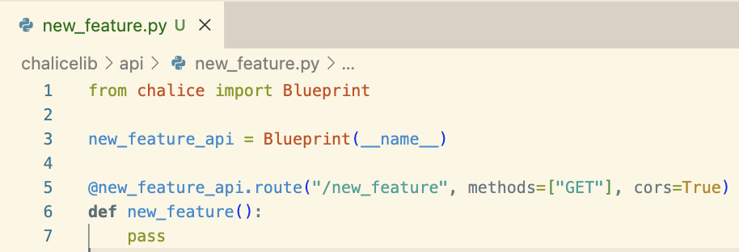

This page contains the onboarding guide to Whyphi's applications.

## Zap

### Setting Up - Local Environment

Zap is developed using Python 3.9. Ensure that you have Python 3.9 installed. To manage dependencies, Zap uses [Pipenv](https://pipenv.pypa.io/en/latest/), a Python virtualenv management tool.

Install pipenv to your machine by using: `pip install --user pipenv` or by following the pipenv documentation.

### Setting Up - Amazon Web Services

Zap utilizes many AWS services. To get started with AWS, ensure that you have the [AWS CLI](https://aws.amazon.com/cli/) installed. Then, set the necessary AWS configuration within your system using: `aws configure`. Receive the necessary AWS credentials from another member in the PCT Tech Team.

### Local Development

To turn on the virtual environment using `pipenv`:
```bash
pipenv shell
```

To install all necessary dependencies within `pipenv` from our repo:
```bash
pipenv install
```

To install any additional dependencies within `pipenv`:
```bash
pipenv install {dependency name}
```

To enable local server for Chalice:
```bash
chalice local
```

### Exploring & Testing API Endpoints: Tools & Tips

Calling APIs efficiently is essential for developers. While cURL requests are powerful, there are user-friendly alternatives:

1. [Postman](https://www.postman.com/downloads/?)
2. [HTTPie](https://httpie.io/desktop)

Choose a tool that suits your comfort level and workflow. Both Postman and HTTPie streamline API testing and development tasks.

### Directory Structure

In AWS Chalice, the application itself is served under the root directory in a file called `app.py`. All other subdirectories and modules need to be created under a directory called `chalicelib`.

### Exploring `chalicelib`

Within the `chalicelib` directory, many directories exist. Let's now see the purpose of each directories:

#### `chalicelib/api`

This is where all API endpoints are created in our backend application. We leverage [blueprints](https://aws.github.io/chalice/topics/blueprints.html) to organize our application into logical components.

To create your own blueprint and API endpoints, create a new file in api, intialize a new blueprint object, and create your endpoints:
  

To ensure that your API gets registered to the chalice application, go to `app.py`, import the blueprint and register it on `app` object:
  

#### `chalicelib/models`

Models is where we create the data structure and types for data that the application works with. To ensure that our data is consistent throughout our application, we utilize [Pydantic](https://docs.pydantic.dev/latest/), a data validation library for Python.

If there is a need to create new data types for new features, initialize a new model through Pydantic, and you can use it for validation purposes.

#### `chalicelib/services`

For Zap, we attempt to use a layered architecture. The general schema of layers on a backend application is shown below:
  

The `services` directory acts as the service layer for Whyphi, in which it contains business logic and handles data manipulations. "Generally services contain information that is related to their domain.

For example, if we have "Mail Service" we expect that sending/receiving emails happens there like in a real life. The same is fair for the codebase. Services (and their methods) handle the business logic which means that they are responsible for transforming data, performing additional actions (like asking the repository for additional data or another service for processing some logic for it)."

To learn more: https://dev.to/blindkai/backend-layered-architecture-514h

To create a new service module, create a new file called `{service_name}Service.py` and create a class. Then, create an instance of that class at the bottom of the file, so we can import the instance directly from other files. Here is an example of `ApplicantService.py`:
```Python
# chalicelib/services/ApplicantService.py

class ApplicantService:
    def __init__(self):
        self.table_name = "apps"

    def get(self, id: str):
        data = db.get_item(table_name=self.table_name, key={"applicantId": id})
        return data

    def get_all(self):
        data = db.get_all(table_name=self.table_name)
        return data

    def get_all_from_listing(self, id: str):
        data = db.get_applicants(table_name=self.table_name, listing_id=id)
        return data

applicant_service = ApplicantService()
```

#### `chalicelib/modules`

**CURRENTLY BUILDING / NOT IMPLEMENTED**

For Whyphi, we take advantage of a lot of microservices and cloud applications. This means that we need different functionalities for each service to handle the data and/or logic. Thus, for each microservice or application, we would create a file and put them in `modules.`

For example, in Whyphi, we use MongoDB and AWS S3. Each microservice would have its own file with specific functionalities that we would use. For those services, we would create the following files:
- `chalicelib/modules/s3.py`
- `chalicelib/modules/mongodb.py`

### Unit Tests

Unit testing is an important part to ensure that changes on our codebase does not break existing features and functionalities. For Zap, we mainly use [`pytest`](https://docs.pytest.org/en/7.4.x/), a Python testing framework.


#### Creating Test File

All unit tests are created under the `tests` directory, and each directory and/or file would correspond to each file in chalicelib and the application itself. For example, if we wanted to create unit tests for `chalicelib/services/ApplicationService.py`, we would create a file like `tests/services/test_application_service.py`.

#### Creating and Running Tests

**NOTE: All test files names must have the prefix `test_`**

To create a test, create a function with the prefix name `test_`, and proceed with unit testing. 

To run the unit test, run the `pytest` command and it will show if you passed or failed any tests.

  

#### Code Coverage

Code coverage is a metric that can help you understand how much of your source is tested. It's a very useful metric that can help you assess the quality of your test suite.

To run and generate the code coverage report, run `make coverage`. You will have re-run this command everytime you make changes to your unit test suite.

  

To view the code coverage report, open `htmlcov/index.html` and it will give a summary of how much code was covered from the unit tests. Click on a specific file from the report to get a detailed view of which lines were covered and not.

The green lines indicate that the unit tests hit these lines, where as the red lines mean the opposite. For this example, we can see that the else case and the exception case on `delete_item` was not tested in the `db.py` file:

  

