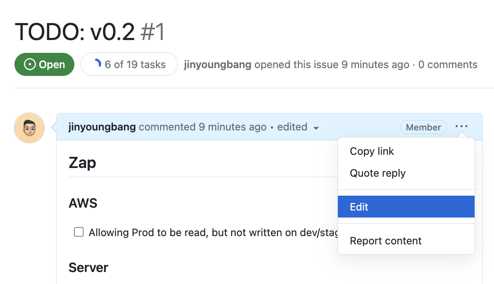
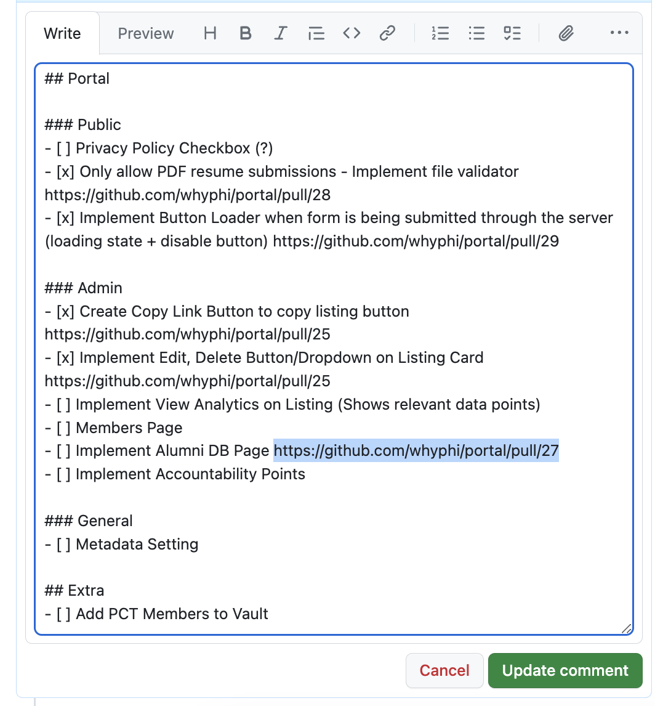

[Tracker](https://github.com/whyphi/tracker) is Whyphi's progress tracking repository. The repository itself does not contain any code, but rather utilizes GitHub's issues feature to track work in progress and features that are complete.

Why Tracker? It's important to gain visibility on which features are completed before a version release to production. Since our backend and frontend repositories are separated, there needs to be more attention taken care of before deploying our services to production. Tracker helps minimize the risk of bugs and issues for a decoupled service.

### How to use Tracker?

All progress will be located on issues: https://github.com/whyphi/tracker/issues

If you are currently working on a feature, copy and paste the link to your Pull Request next to the checkbox:

1. Click on `Edit`
   

2. Copy and paste your pull request URL next to the checkbox for the corresponding feature
   

3. Click the `Update comment` button

4. If you complete your feature, mark the checkbox to indicate your feature has been completed.
