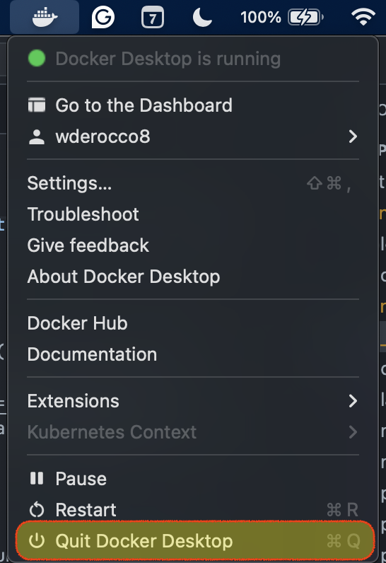
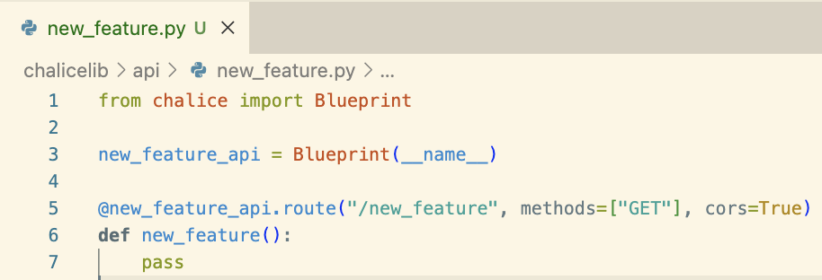
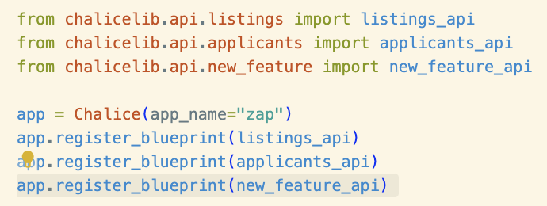
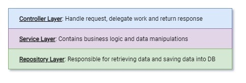
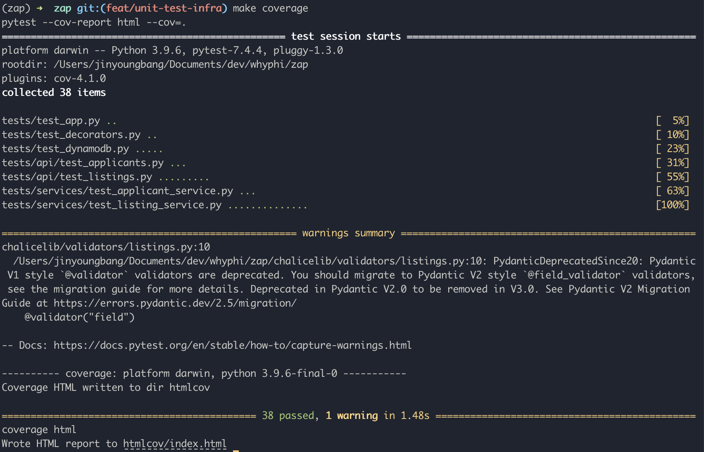
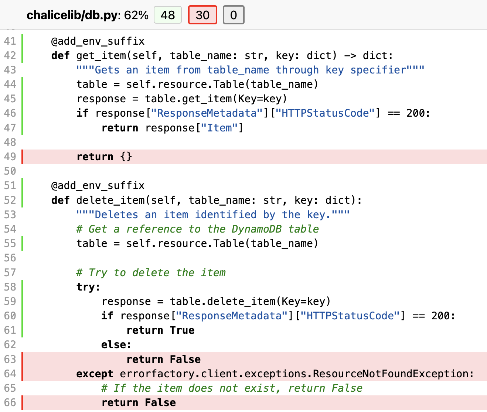
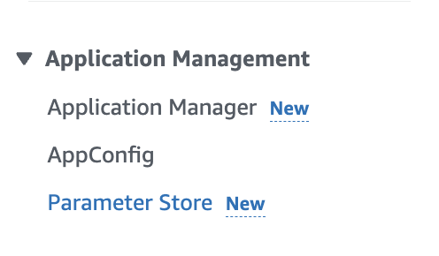
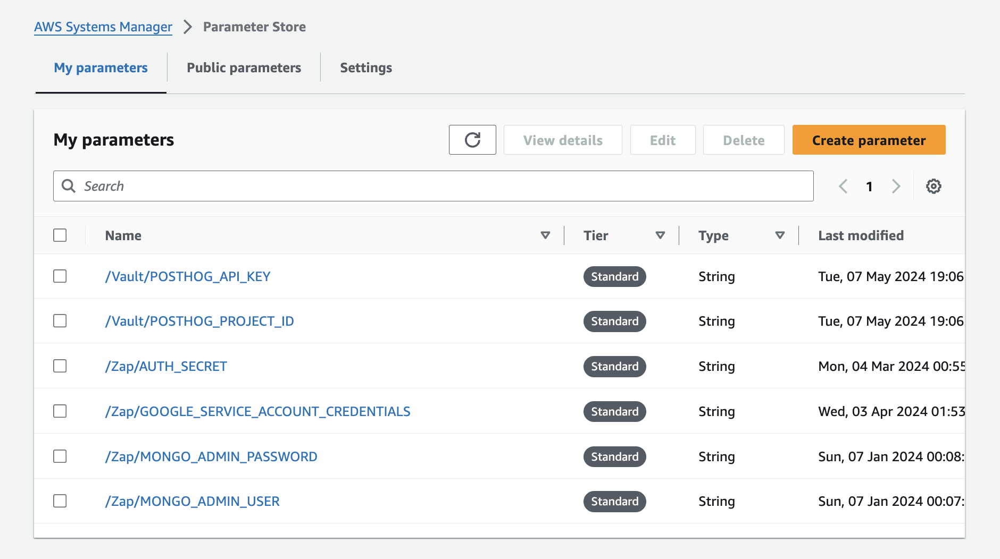
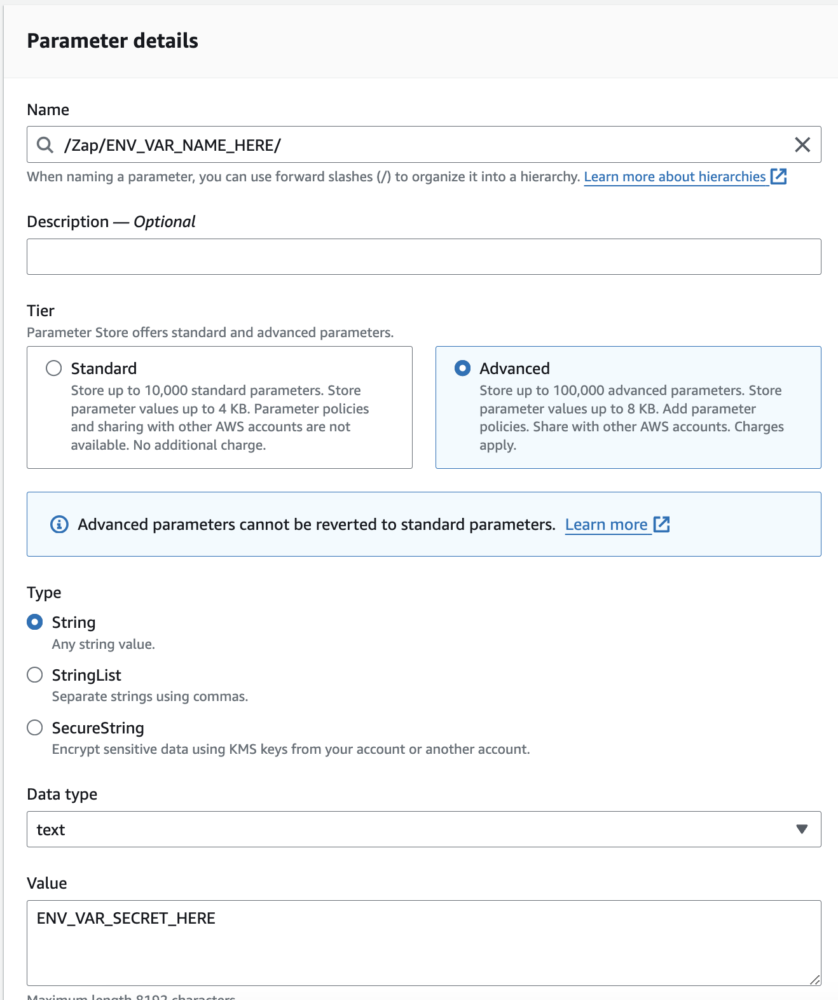

### Setting Up - Local Environment

Zap is developed using Python 3.9. Ensure that you have Python 3.9 installed. To manage dependencies, Zap uses [Pipenv](https://pipenv.pypa.io/en/latest/), a Python virtualenv management tool.

Install pipenv to your machine by using: `pip install --user pipenv` or by following the pipenv documentation.

### Setting Up - Amazon Web Services

Zap utilizes many AWS services. To get started with AWS, ensure that you have the [AWS CLI](https://aws.amazon.com/cli/) installed. Then, set the necessary AWS configuration within your system using: `aws configure`. Receive the necessary AWS credentials from another member in the PCT Tech Team.

{}

On your command line, type and enter `cat ~/.aws/credentials`. Double check that the access key is same as the one in our [AWS Console](https://us-east-1.console.aws.amazon.com/iam/home#/security_credentials).

If the keys are the same, proceed to share both the AWS Access Key and Secret Keys to the onboarding member.

**NOTE: Please do not share your personal keys to anybody else.**

{}

This is how your `aws configure` should look like:

```{filename="aws configure"}
AWS Access Key ID [********************]: {AWS Access Key}
AWS Secret Access Key [********************]: {AWS Secret Access Key}
Default region name [us-east-1]: us-east-1
Default output format [json]: json
```

### Setting up - Supabase

As of `dev/v4.0`, Zap will run entirely on Supabase (instead of DynamoDB and MongoDB). Since we have 3 databases total (`local` docker, `staging`, and `prod`), you must complete the following steps in order to develop locally.

{}

Docker is an industry-standard platform used to build, ship, and run applications using [containerization](<https://en.wikipedia.org/wiki/Containerization_(computing)>). Supabase handles almost all of the complexities on our behalf, but if you want to learn more, I'd strongly suggest taking a look at Docker's [docs and tutorials](https://www.docker.com/trainings/).

{}

1. Install [Docker Desktop](https://docs.docker.com/desktop/setup/install/mac-install/) (be sure to select the correct machine you are working on)
2. Install [Supabase CLI](https://supabase.com/docs/guides/local-development?queryGroups=package-manager&package-manager=brew) **NOTE:** Do not run the `supabase init` and `supabase start` commands (Supabase is already initialized inside of `zap`)
3. Navigate to the `zap` directory
4. Run `supabase start` to spin up the database

After this command, you should see output that looks like this (if not, you can always run `supabase status` to obtain info about the database).

```shell
Started supabase local development setup.

         API URL: xxxxxxxxxxxxxxxxxxxxxxxxxxxxxx
     GraphQL URL: xxxxxxxxxxxxxxxxxxxxxxxxxxxxxx
  S3 Storage URL: xxxxxxxxxxxxxxxxxxxxxxxxxxxxxx
          DB URL: xxxxxxxxxxxxxxxxxxxxxxxxxxxxxx
      Studio URL: xxxxxxxxxxxxxxxxxxxxxxxxxxxxxx
    Inbucket URL: xxxxxxxxxxxxxxxxxxxxxxxxxxxxxx
      JWT secret: xxxxxxxxxxxxxxxxxxxxxxxxxxxxxx
        anon key: xxxxxxxxxxxxxxxxxxxxxxxxxxxxxx
service_role key: xxxxxxxxxxxxxxxxxxxxxxxxxxxxxx
   S3 Access Key: xxxxxxxxxxxxxxxxxxxxxxxxxxxxxx
   S3 Secret Key: xxxxxxxxxxxxxxxxxxxxxxxxxxxxxx
       S3 Region: xxxxxxxxxxxxxxxxxxxxxxxxxxxxxx
```

Before you move on, copy and paste your `API URL` and `anon key` from above into a file called `zap/.env.local` (**NOTE:** This file must be in the root of the `zap` directory, and it should _not_ be checked into source control).

```.env {filename="zap/.env.local"}
SUPABASE_URL=<API URL>
SUPABASE_KEY=<anon key>
```

You can now proceed to running the backend using the steps below. Be sure to run `supabase stop` when your done running the backend to safely shut down the database.

{}

The safest way to shut down the database is by running `supabase stop`. However, you can get away with simply quitting Docker Desktop to save time. This will also prevent you from having to run `supabase start` every time you want to run `zap` (nonetheless it _is_ considered better practice to run `supabase start/stop` to ensure the databse is health/uncorrupted).

If you do chose the "quitting Docker Desktop" approach, just make sure you fully quit the application (see screenshot below) or your CPU will hate you 😡.



{}

### Local Development

To turn on the virtual environment using `pipenv`:

```bash
pipenv shell
```

To install all necessary dependencies within `pipenv` from our repo:

```bash
pipenv install
```

To install any additional dependencies within `pipenv`:

```bash
pipenv install {dependency name}
```

To enable local server for Chalice:

```bash
chalice local
```

### Exploring & Testing API Endpoints: Tools & Tips

Calling APIs efficiently is essential for developers. While cURL requests are powerful, there are user-friendly alternatives:

1. [Postman](https://www.postman.com/downloads/?)
2. [HTTPie](https://httpie.io/desktop)

Choose a tool that suits your comfort level and workflow. Both Postman and HTTPie streamline API testing and development tasks.

### Directory Structure

In AWS Chalice, the application itself is served under the root directory in a file called `app.py`. All other subdirectories and modules need to be created under a directory called `chalicelib`.

### Exploring `chalicelib`

Within the `chalicelib` directory, many directories exist. Let's now see the purpose of each directories:

#### `chalicelib/api`

This is where all API endpoints are created in our backend application. We leverage [blueprints](https://aws.github.io/chalice/topics/blueprints.html) to organize our application into logical components.

To create your own blueprint and API endpoints, create a new file in api, intialize a new blueprint object, and create your endpoints:


To ensure that your API gets registered to the chalice application, go to `app.py`, import the blueprint and register it on `app` object:


#### `chalicelib/models`

Models is where we create the data structure and types for data that the application works with. To ensure that our data is consistent throughout our application, we utilize [Pydantic](https://docs.pydantic.dev/latest/), a data validation library for Python.

If there is a need to create new data types for new features, initialize a new model through Pydantic, and you can use it for validation purposes.

#### `chalicelib/services`

For Zap, we attempt to use a layered architecture. The general schema of layers on a backend application is shown below:


The `services` directory acts as the service layer for Whyphi, in which it contains business logic and handles data manipulations. "Generally services contain information that is related to their domain.

For example, if we have "Mail Service" we expect that sending/receiving emails happens there like in a real life. The same is fair for the codebase. Services (and their methods) handle the business logic which means that they are responsible for transforming data, performing additional actions (like asking the repository for additional data or another service for processing some logic for it)."

To learn more: https://dev.to/blindkai/backend-layered-architecture-514h

To create a new service module, create a new file called `{service_name}Service.py` and create a class. Then, create an instance of that class at the bottom of the file, so we can import the instance directly from other files. Here is an example of `ApplicantService.py`:

```Python
# chalicelib/services/ApplicantService.py

class ApplicantService:
    def __init__(self):
        self.table_name = "apps"

    def get(self, id: str):
        data = db.get_item(table_name=self.table_name, key={"applicantId": id})
        return data

    def get_all(self):
        data = db.get_all(table_name=self.table_name)
        return data

    def get_all_from_listing(self, id: str):
        data = db.get_applicants(table_name=self.table_name, listing_id=id)
        return data

applicant_service = ApplicantService()
```

#### `chalicelib/modules`

For Whyphi, we take advantage of a lot of microservices and cloud applications. This means that we need different functionalities for each service to handle the data and/or logic. Thus, for each microservice or application, we would create a file and put them in `modules.`

For example, in Whyphi, we use MongoDB and AWS S3. Each microservice would have its own file with specific functionalities that we would use. For those services, we would create the following files:

- `chalicelib/modules/s3.py`
- `chalicelib/modules/mongodb.py`

### Unit Tests

Unit testing is an important part to ensure that changes on our codebase does not break existing features and functionalities. For Zap, we mainly use [`pytest`](https://docs.pytest.org/en/7.4.x/), a Python testing framework.

#### Creating Test File

All unit tests are created under the `tests` directory, and each directory and/or file would correspond to each file in chalicelib and the application itself. For example, if we wanted to create unit tests for `chalicelib/services/ApplicationService.py`, we would create a file like `tests/services/test_application_service.py`.

#### Creating and Running Tests

**NOTE: All test files names must have the prefix `test_`**

To create a test, create a function with the prefix name `test_`, and proceed with unit testing.

To run the unit test, run the `pytest` command and it will show if you passed or failed any tests.

  

#### Code Coverage

Code coverage is a metric that can help you understand how much of your source is tested. It's a very useful metric that can help you assess the quality of your test suite.

To run and generate the code coverage report, run `make coverage`. You will have re-run this command everytime you make changes to your unit test suite.

  

To view the code coverage report, open `htmlcov/index.html` and it will give a summary of how much code was covered from the unit tests. Click on a specific file from the report to get a detailed view of which lines were covered and not.

The green lines indicate that the unit tests hit these lines, where as the red lines mean the opposite. For this example, we can see that the else case and the exception case on `delete_item` was not tested in the `db.py` file:

  

### Setting Environment Variables in Chalice

Setting up environment variables are a little bit more complicated in Chalice. However, it is crucial to understand and know how to implement them as we work with sensitive credentials from other external services.

Currently, our local backend is configured to utilize AWS services on a development environment/service. This means local environment variables are technically hosted on the cloud as well.

#### Creating an Environment Variable

First, navigate to **AWS Systems Manager**. Then, navigate to **Parameter Store** on the sidebar under Application Management:



Then, click **Create parameter** to create an environment variable:



Fill out all the necessary details for your environment variable (try your best to keep the name formatting relevant and consistent):



Click **Create parameter**.

#### Providing Environment Variable Access for Chalice

To use AWS services on chalice, the necessary permissions need to be provided or else AWS denies the specific resource when requested. Param Store environment variables are considered as a resource and we need to specify that our application should have access to request it.

On Zap's directory, navigate to `.chalice`. Inside it, you will see both `policy-dev.json` and `policy-prod.json`. Inside both json files, navigate to `"Resource"` and add your new parameter to the respective files. Your Chalice application should now have access to request the new environment variables you created.
