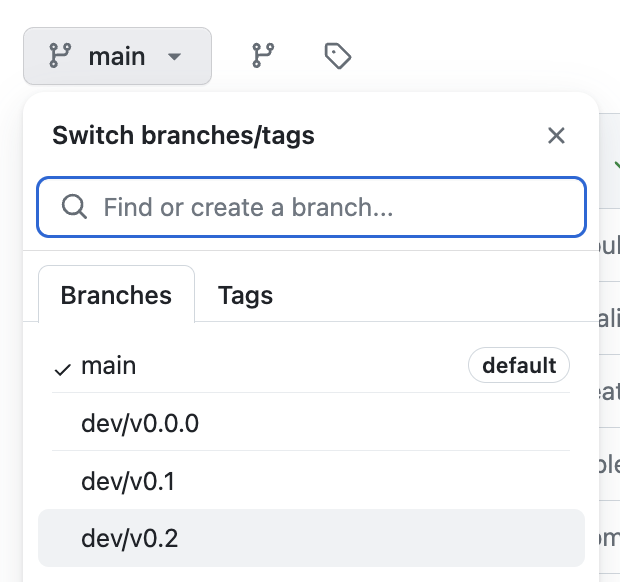
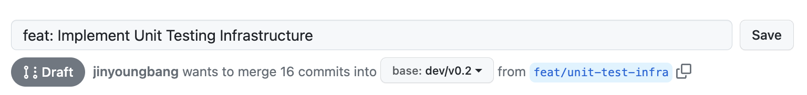

This page contains the documentation related to the recommended development workflow for building on Whyphi's applications.

## General

All of Whyphi-related applications will be hosted on GitHub. Thus, it is necessary to be proficient with GitHub in general. Whyphi's GitHub repository can be found [here](https://github.com/whyphi).

### Vault

To gain access to Whyphi, it is necessary that you have your email and name on [Vault](https://github.com/whyphi/vault). Vault is Whyphi's YAML-based Access Management System.

1. Clone the vault repository
2. Create a new branch
3. Edit `vault.yaml` file by adding your name and email like the following:
    ```YAML
    users:
    - name: First_Name1, Last_Name1
      email: youremail1@bu.edu
    - name: First_Name2, Last_Name2
      email: youremail2@bu.edu
    ```
4. Submit a Pull Request with your information
5. Merge the PR by getting it reviewed by another member.


### GitHub Branching & Pull Request Practices

When initiating development on a repository, it's essential to base your branch on the most recent dev branch to ensure synchronization. To identify the latest development branch, navigate to the branch sidebar and locate the highest version:



*In this case, the lastest branch is `dev/v0.2`*.

Next, switch your branch to `dev/v0.2` or the latest branch: `git checkout dev/v0.2` **(ensure all remotes and branches are updated in your local repository).**

Create a new feature branch from `dev/v0.2`: `git checkout -b feat/{feature_name}` and commence your work on the feature.

Remember to periodically sync your feature branch with the dev branch to incorporate any updates:

1. While on your feature branch: `git fetch origin dev/v0.2` followed by `git merge origin/dev/v0.2` or your preferred way.
2. Resolve any conflicts that arise during the merge process.

Once your feature is complete and tested:

1. Push your feature branch to the remote repository: `git push origin feat/{feature_name}` or your preferred way.
2. Create a pull request on GitHub to merge your feature branch into `dev/v0.2`. **Ensure your base branch of your Pull Request is the development branch**
    
3. Ensure your pull request details contain comprehensive information about the changes introduced.


### GitHub Draft Pull Requests

Don't miss out on the advantages of draft pull requests! They're a game-changer for managing your work in progress and enhancing visibility across your team.

Take a moment to dive into this informative [blog post](https://github.blog/2019-02-14-introducing-draft-pull-requests/) to grasp the power of draft PRs and learn how to create them seamlessly.

By using draft pull requests, you can:
- Clearly signal that your work is in progress.
- Collect feedback early in the development process.
- Prevent premature merges and maintain code integrity.

## Zap

Work in progress.